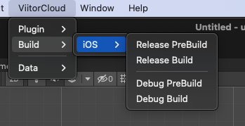
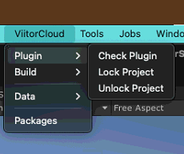

## Introduction

Base-Project is unity project which will be in GitHub with basic build code. It will have necessary packages developed by VC devs individually.

Any new project will be built on this project.

## Steps

1. Git LFS Installation Instruction 
   1. *cd $(brew --repo homebrew/core) && git fetch && git reset --hard origin/master*
   2. *brew install git-lfs*
   3. *git lfs install* (We need to run this cmd before every git clone).
2. Clone Base project: *“git clone <https://github.com/viitoradmin/unityvc-base-project.git>”*
3. Rename folder name as “*<Your Project>-base-project*” (eg: *RealAssist-base-project*)
4. **Start Unity – This Step is Important**
5. Go to directory
   1. *cd unityvc-base-project-<Your Project>*
   2. *cd Games*
   3. *Clone your project: git clone <repo-url>*
   4. Navigate to ***“Assets/Games/<Repo-Name>/”***
6. Right click on project window Go to ***ViitorCloud->Plugin->Plugin Info***
7. Enter third-party plugin details 
   1. Right Click on project window Go to ***ViitorCloud->Build Config->Game** Info*
   
   
8. Enter Project Details

Components
- ## Base Project Components
1. Build Data
2. Custom Data
- ## Project Components
1. Plugin Info
2. Game Info
3. Build Info
- ## Base Project Components
- Build Data	
  - This component will have the information about the build configs of the game. 
   
  - **Scenes**
    - If there is any scene which should be included in every project then path of the scene should be mention here.
    - It will be included automatic.
  - **Build Folder Base\_** 
    - This is the path of the folder where the build will be generated.
    - This path will start from “Assets” path. Eg (/Users/vc-
    - unity/Documents/BaseProject/unityvc-base-project/**Builds/**)
  - **Auto Update Android Version**
    - After building the android build version code will get increased automatically if this is ticked.
  - **Auto Update iOS build number**
    - After building the iOS build build number will get increased automatically if this is ticked.
  - **Build Configs**
    - Build Config Object
      - Name: Name of the config Should be (Target-Debug , Beta or Release)
      - Target: Target platform
      - DevelopmentBuild : is this config development?
      - IsBetaBuild: is this Beta config.
      - Scenes: Any specific scene to be added in build for this config.
      - Product Name: Override Product name for this config.
      - Bundle Id: Override Bundle ID for this build
      - Icon path: Overrride icon for this config
      - Orientation: override orientation for this config.
      - Compile Define Addition: Any Pre-Processors to be added in the build for this config
      - Compile Define Remove: Any Pre-Processors to be removed in the build for this config
  - If you need new config for build you can added here
    - EG:
      - Name: Windows-Debug
      - Target : Windows 
      - Development build: Tick
      - Beta Build: Untick
      - Scenes: “Assets/Games/<RepoName>/Scenes/DebugScene.unity
      - Product Name: <Product Name>-Debug
      - Bundle ID: null
      - Icon path: null
    - This will create new config and you will have to switch to the Target platfor to see the config in Build Menu.
  - **Build Menu**
    - Youcan access the Build Menu from ViitorCloud->Build->Target Platform -> PreBuild , Build
    - 
    - *PreBuild and Build in next Section*

- ## Custom Data
  - 
  - This class will be used for Constant Path which can be used by child projects 
  - Work in progress

- ## Project Components
  - ## Plugin Info
    - This serialized object contains information of all the third-party assets which must not be uploaded to git.
    - Every third-party asset must be referenced here.
    - **This serialized object must exist in all project.**
    - The path of this serialized object must be Directly in Repo 
      - EG
        - Assets/Games/<RepoName>/<PROJECTNAME>PluginInfo.asset
    - 
    - Plugin Info Object
      - Plugin Name: Name of the Plugin
      - Plugin Path: Path of the plugin in project
        - This should be start from “Assets” and end on folder of the plugin.
      - Plugin Version: version of the plugin
      - Plugin Download URL: URL from where this plugin can be download.
    - After entering all the third-party plugin to this serialized object goto **VittorCloud-> Plugin -> Check Plugin**
    - This will add the paths of the plugin mentioned to the ignore file.
  - If you are working on a project which has third party assets then there will be errors because of the missing asset
    - In this case check the MS Teams -> Project’s Group -> General -> Package, there must be unitypackges file which will contain all the assets.
  - 
    - Check Plugin: This option will add third-party plugins to gitignore file and also checks if all the third-party assets are available on the disk.
    - Lock Project: When you are getting errors in your code of missing third-party assets then  you can turn off the scripts of yours (only those script which are not in pluginInfo object)
      - Once you select this all the errors will be gone and then you can import the assets
    - Unlock Project: Once you import all the assets you can unlock your project by clicking here

- ## Game Info

- **This serialized object contains information of Game**
- The path of this serialized object must be Directly in Repo 
  - EG
    - Assets/Games/<RepoName>/<PROJECTNAME>GameInfo.asset
- 
- Game ID: Project Name
- Repo Path: URL of this project’s repo
- Scenes: List of scene which should be included in the build
- Photon ID: If your game uses Photon then enter the photonID here else keep it empty
- Agora ID: If your game uses Agora then enter the AgoraID here else keep it empty
- Project Settings
  - Color Space : Seletct which color space your project’s lighting will be
  - Tags & Layers – If you project uses more tags/layers than default then add all here
    - When you clone the project again then from this list the tags/layers will be restored.
  - Physics
    - Enter the custom physics details here such as Collision Matrix
- Build Properties
  - Title: Name of the Project
  - Bundle ID: bundle ID of the project
  - Version: version of the project
  - Icon: texture of the icon
  - Splash Screen Logo
  - Splash Screen Logo BG
  - Splash BG Blur
  - Screen Orientation 
- Built-In Packages Settings
  - **DO NOT EDIT ANY BOOL HERE**
  - Assign rendering pipeline asset if your project is not on Standard Pipeline.
  - Add AR,VR, URP, HDRP, Addressable package from here only
  - 